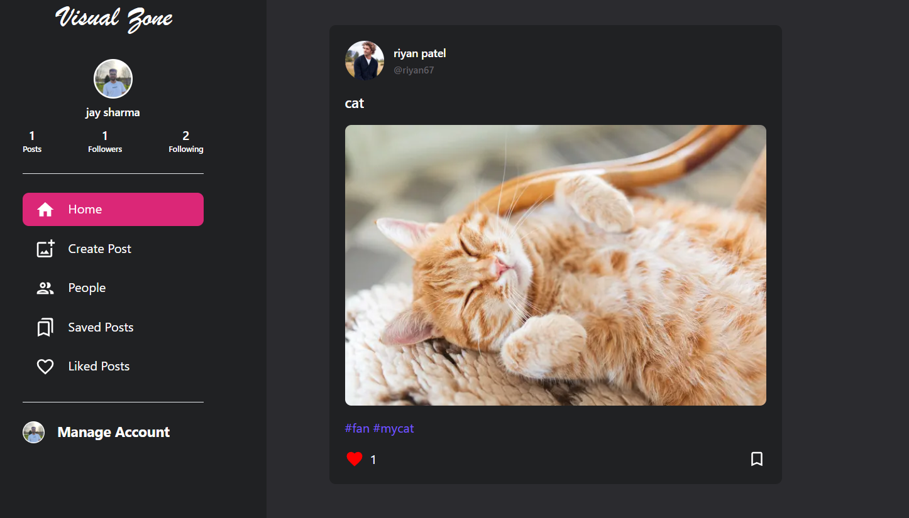
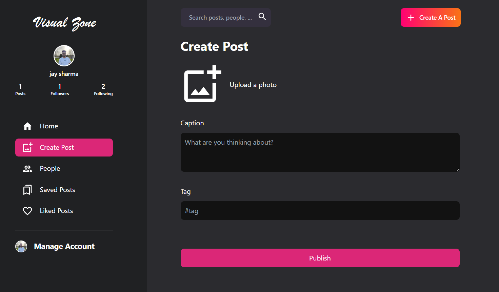
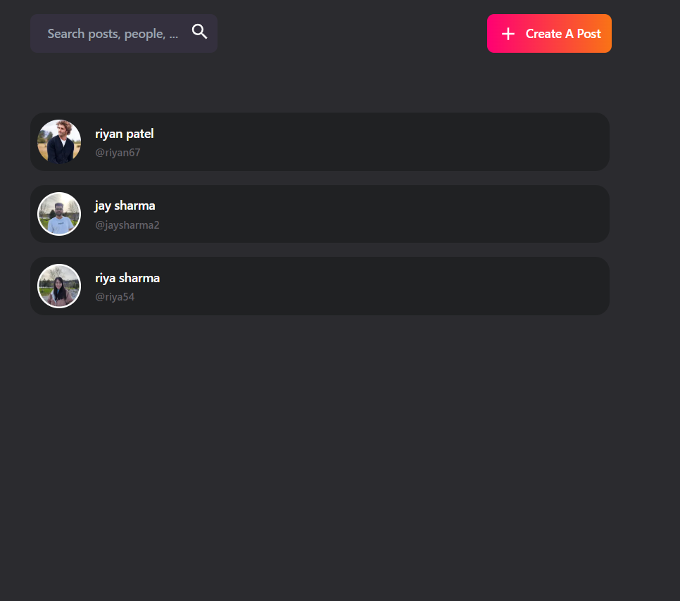
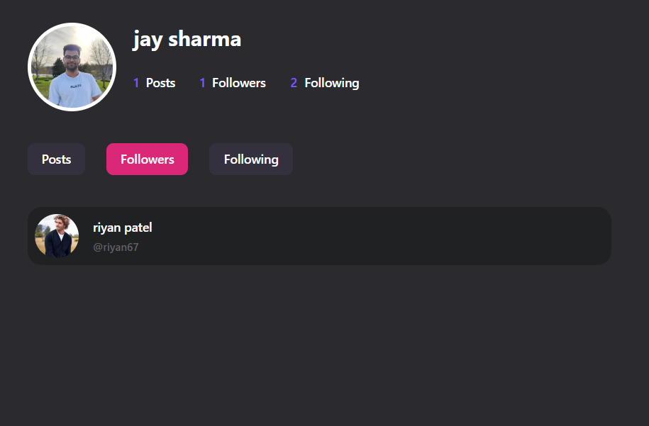
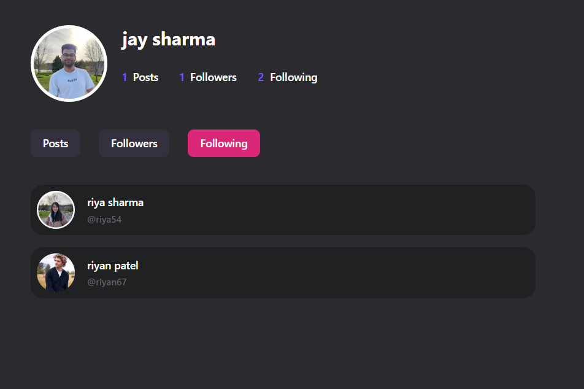

<h1 align="center">📲 Visual Zone social media app 📲</h1>

 

 ## 🔐 Authentication

- Users can Sign Up to create an account

- Users can Sign In with existing credentials

 

 ## 📝 Post Creation & Management

-  **Users can create posts with:**

      -  Photo

      - Caption

      - Hashtags

- Users can edit their own posts

- Users can delete their own posts

 

## 👀 Post Interaction

- Users can view posts from others

- Users can like other users posts

- Users can save/bookmark other users posts

- Users can view all their liked posts

- Users can view all their saved/bookmarked posts

 

## 🔗 Follow System

- Users can follow other users

- Users can be followed back by others

- Shows followers and following lists/counts

 

## 🛠️ Tech Stack 

- **Frontend**: Next.js with React – for fast, dynamic UI with server-side rendering

- **Backend**: Next.js API Routes – handles auth, post, like, follow logic within the same app

- **Database**: MongoDB with Mongoose – flexible data storage for users, posts, and actions

- **Cloudinary**: cloud image hosting and optimization for user-uploaded photos

- **Tailwind CSS**: utility-first framework for clean, responsive UI

- **Additional Libraries**: Several other libraries and tools are used for enhanced functionality, security, and better user experience (such as form handling, UI components, and state management).

# Website Preview

 

        

        

        

        

        

        

